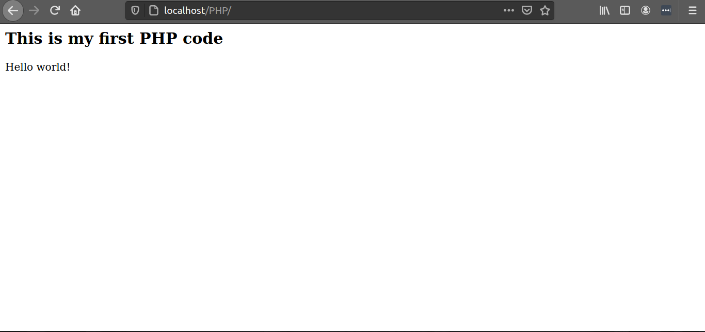

### GETTING STARTED WITH PHP
PHP is a Web server programming language. It allows developers to create content that interacts with the database. PHP stands for Hypertext Preprocessor and it is used for developing web-based applications.


### Why PHP?
The following are some benefits of PHP :
- PHP is used in creating the website. The following  are PHP framework used to develop websites:
- [YII 2](https://www.tutorialspoint.com/yii/index.htm),
- [Laravel](https://laravel.com/)
- [FuelPHP](https://fuelphp.com/)
 which developers use in creating a website since they speed up the web development.
- PHP is integrated with a database like Maria database.
- Easy for beginner's who want to study server-side languages
- PHP can create, open, read, and close files on the server.
- PHP can add and change data in a database.
- Using PHP you can restrict users from accessing some of your websites

### Prerequisites
Before you start proceeding with this article, make sure you have:
- PHP installed. This will be downloaded as we install the Web server.
- Web server like Xampp. Download Xampp[here](https://www.apachefriends.org/download.html) . In this article, we will use Ubuntu. A folder ```opt/lampp``` will be created after your done with the installation.

### Creating PHP files
Navigate in ```opt/lampp/htdocs``` and open this folder using the terminal to create a PHP folder. where we will have our PHP files. Use the command below to create a folder ``PHP`` 

```bash
$ sudo mkdir PHP
```
To confirm that the folder ``PHP`` was created type the following command:
```bash
$ ls
PHP 
```
To create a file ```index.php``` in ```/opt/lampp/htdocs/PHP``` type the following command
```bash
sudo nano index.php
```
To open the file ```index.php``` using [Getit](https://wiki.gnome.org/Apps/Gedit) type the following command:
```bash
sudo gedit index.php
```
### PHP SYNTAX
PHP code starts with <?php and ends with ?> as shown below:
```PHP
<?php
// php code is written here
?>
```
Example
In the ```index.php```file that was created above enter the following code:
```html
<html>
 <body>
 <h2>This is my first PHP code </h2>
      <?php
       echo "Hello world!";
      ?>
 <body>
</html>
```
The PHP file above contains HTML tags and some PHP scripting code.
The work of the echo statement is display output on the  screen. 

To view the output of the above code, browse http://localhost/PHP using any browser. 
Here, PHP is the folder that contains our files.

You should have something like this image on your browser:


Congratulations! You have created your first PHP program.

### PHP Conditional statement
Condition Statements are used to perform different types of actions.
Conditional statements in PHP include :

- If statement - In this statement, if there is a true condition some code will be executed
- if...else statement -  This statement executes either true or false code depending on the condition. This means that this statement contains two conditions.

- if...else if...else statement - In this statement many codes are executed for more than one condition

Lets us look at each statement at a time:

1) if statements

syntax

```php
<?php
 if(condition){
      echo"Code to be executed only if the condition is true";
  }  
?>
```
Let's look at each line above:

if(condition) -This is where we will put our condition that the code will follow so that it can get executed.

echo"Code to be executed only if the condition is true"; - The output to be executed is located here. This part is always inside the carry braces.

Example:

<?php
$age = 15;

if ($age < "18") {
  echo "your are a kid!";
}
?>
The output here should be ;
```
you are a kid!!
```
From the above example we have:
- $age = 15; - variable $age is defined and a value 15 is assigned to it.
In PHP, Variables are declared by first writing the $sigh followed by the name of the variable.
- if ($age < "18")- this the condition to be followed.
- echo "you are a kid!"- this will be the output if the condition is true

2) if...else statement 

syntax

if(condition){
    echo"code to be executed";
}
else{
    echo"code to be executed";
}

Example:
<?php
$age = 18;
if($age< 18){
    echo"your are a child";
}
else{
    echo"Your are a youth";
}
?>
The output should be:
```
You are a youth
```
This is because the age is not less than 18. But, if we assign a value like 17 to variable $age the output should be,
```
you are a child
``` 
3) if...elseif...else statement

syntax

<?php
if (condition) {
if the condition is true this code will be executed;
} elseif (condition) {
  this code is executed if the the 1st condition is false and this condition is true;
} else {
  this code is executed if the 1st and 2nd condition above are false;
 
}
?>

Example:
```php
<?php
$age = "18";
if($age < "18"){
    echo"your are a child";
}
elseif($age > "35"){
    echo"Your are a parent ";
}
else{}
echo"Your are youth";
?>
```

Since the $age = 18 the output of the following code should be:
```
You are youth 
``` 


### Commenting In PHP
Commenting in PHP is done to enable the person reading the code understands it.
 It reminds the owner of the code what every line of the code means and what he was thinking when he wrote the code. A commented line is not executed as a part of the program on the browser. 
 In PHP, there several ways of commenting:

 1)Single line comment

 This is a comment done on one single line.

 Example:
 <?php
   //The work of the echo is to output data on the screen eg:
   echo"The output is:";
    #The above line has been commented.
 ?>

 In the above example, the two lines have been commented out using a single line comment.

 2)Multiple-line comments:
 Here, large code are commented together using /* and */ symbols.

Example:
<?php

 /* This is a multiple_line comment*/
?>

### Conclusion
This is what we have covered in this article:
- Creating PHP files.
- PHP syntax
- Conditional statements
- Commenting in PHP

## Have  good PHP coding ahead

