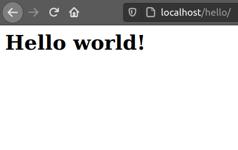

### GETTING STARTED WITH PHP
PHP is a server programming language that allows developers create content that interact with the database. It is an acronym for Hypertext Preprocessor. PHP is mostly used for developing web based applications.
PHP script are always executed on the server while the HTML result is sent back to the browse.


### Why PHP?
The following are some benefits of PHP :
- PHP is used in creating website. PHP has got framework like [YII 2](https://www.tutorialspoint.com/yii/index.htm),[Laravel](https://laravel.com/),[FuelPHP](https://fuelphp.com/)
 which developers use in creating website since they speed up the web development.
- PHP is integrated with database like Maria database.
- Easy for beginner's who want to study server side languages
- PHP can create, open, read,and close files on the server.
- PHP can add and modify data in a database.
- It is free to download.
- Using PHP you can restrict users from accessing some of your websites

### Prerequisites
To start using PHP you must have the following in your machine:
- PHP installed. .This will be downloaded as we install the Web server.
- Web server like Xampp. Download Xampp[here](https://www.apachefriends.org/download.html) In this article we will be working with Ubuntu hence it is advisable that you download Xampp for linux. A folder ```opt/lampp``` will be created after your done with the installation.

### Creating PHP files
Navigate in ```opt/lampp/htdocs``` and open this folder using terminal to create a PHP folder where we will have our PHP files. Use the command below to create a folder ``PHP`` 

```bash
$ sudo mkdir PHP
```
To confirm that the folder ``PHP`` was created successfully type the following command:
```bash
$ ls
PHP 
```
To create a file ```index.php``` in ```/opt/lampp/htdocs/PHP``` type the following command
```bash
sudo nano index.php
```
To open the created file ```index.php``` using [Getit](https://wiki.gnome.org/Apps/Gedit) type the following command:
```bash
sudo gedit index.php
```
### PHP SYNTAX
PHP code starts with <?php and ends with ?> as shown below:
```PHP
<?php
// php code is written here
?>
```
Example
In the ```index.php```file that was created above enter the following code:
```html
<html>
  <body>
    <h2>This is my first PHP code </h2>
      <?php
       echo "Hello world!";
      ?>
  <body>
</html>
```
The PHP file above contains HTML tags, and some PHP scripting code.
A PHP function "echo" is used to output the text "Hello World!" on a web page.The work of echo statement is to output data to the screen.. 

To view the output of the above code, open http://localhost/PHP
Here, PHP is the folder that we created that contains our files.

You should have something similar to this image on your browser:


Congratulations! You have created your first PHP program.

### PHP Conditional statement
Condition Statements are used to perform different types of actions depending on the condition assigned. 
The following conditional statements are found in PHP:

- if statement - some code are executed if one condition is true

- if...else statement - If one condition is true some code is executed and also if the condition is false some code are also executed.

- if...elseif...else statement - In this statement many codes are executed for more than one condition

Lets us look at each statement at a time:

1) if statements

syntax

```php
<?php
  if(condition){
      echo"Code to be executed only if the condition is true";
  }  
?>
```
Let's look at each line above:

if(condition) -This is where we will put our condition that the code will follow so that it can get executed.

echo"Code to be executed only if the condition is true"; - The output to be executed is located here. This part is always inside the carrybraces.

Example:

<?php
$age = 15;

if ($age < "18") {
  echo "your are a kid!";
}
?>
The output here should be ;
```
your are a kid!!
```
From the above example we have:
- $age = 15; - variable $age is defined and a value 15 is assigned to it. 
- if ($age < "18")- this the condition to be followed.
- echo "your are a kid!"- this will be the output if the condition is true

2) if...else statement 

syntax

if(condition){
    echo"code to be executed";
}
else{
    echo"code to be executed";
}

Example:
<?php
$age = 18;
if($age< 18){
    echo"your are a child";
}
else{
    echo"Your are a youth";
}
?>
The output should be:
```
Your are a youth
```
This is because the age is not less than 18. However if we assign a value like 17 to variable $age the output should be,
```
your are a child
``` 
3) if...elseif...else statement

syntax

<?php
if (condition) {
  code to be executed if this condition is true;
} elseif (condition) {
  code to be executed if first condition is false and this condition is true;
} else {
  code to be executed if all conditions are false;
}
?>

Example:
```php
<?php
$age = "18";
if($age < "18"){
    echo"your are a child";
}
elseif($age > "35"){
    echo"Your are a parent ";
}
else{}
echo"Your are youth";
?>
```

Since the $age = 18 the output of the following code should be:
```
Your are youth 
``` 


### Commenting In PHP


